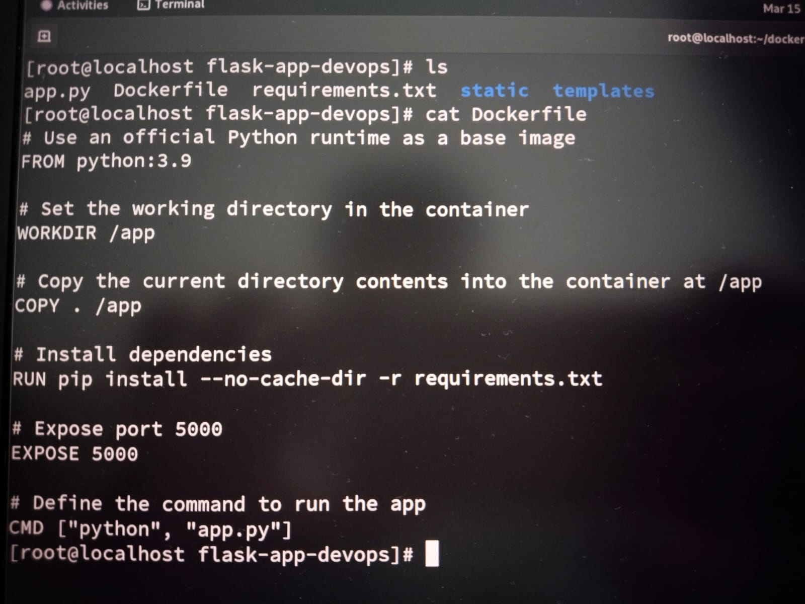
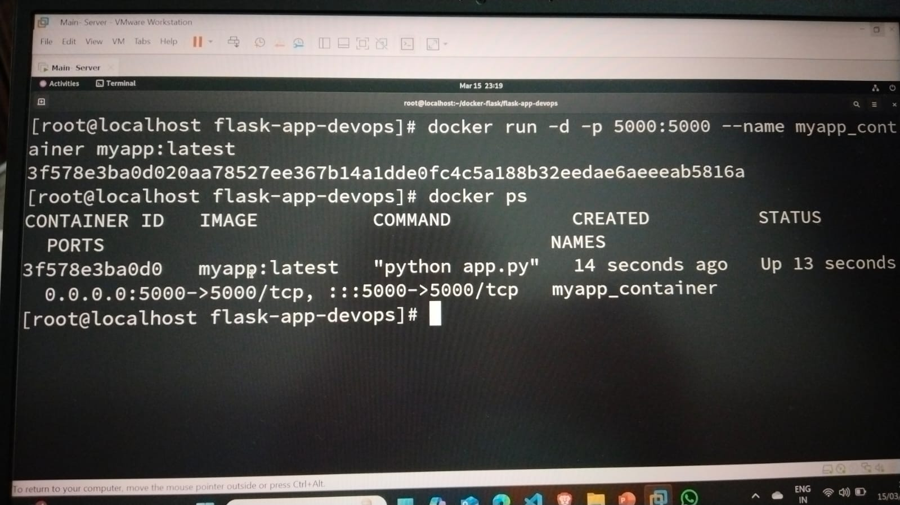
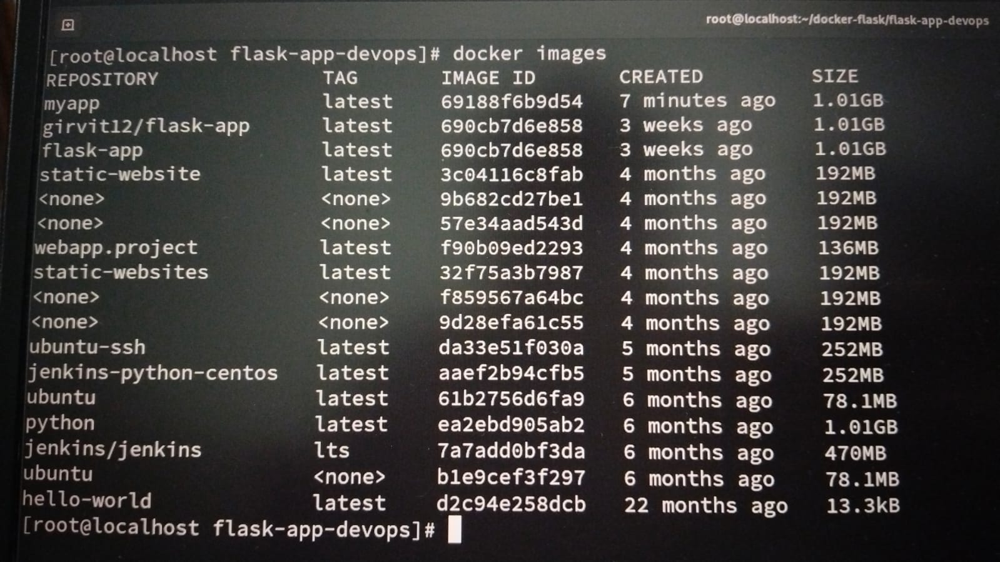
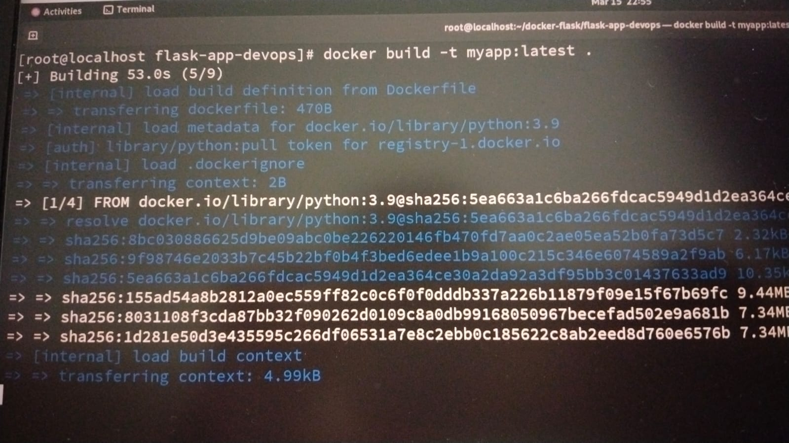
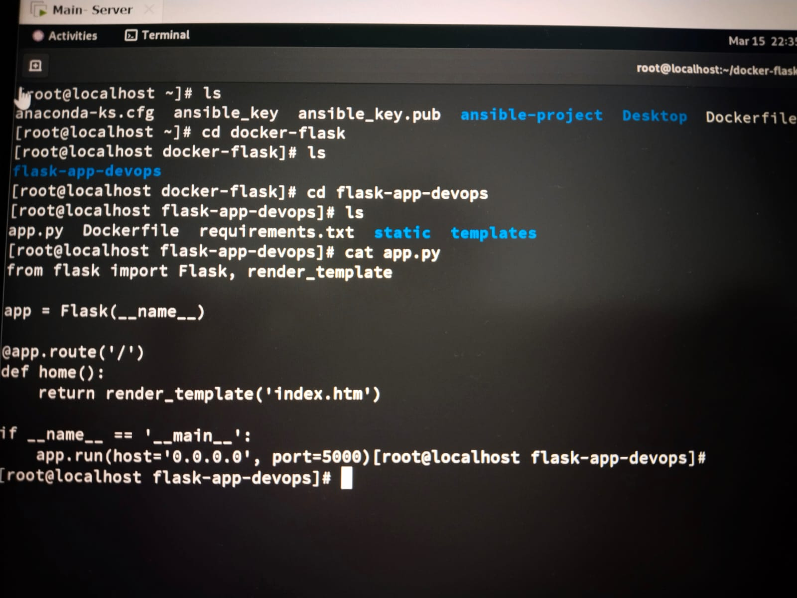

# Static-Website-Docker
Automated the deployment of a static website on a Docker container using a Jenkins CI/CD pipeline.
# Flask App Deployment using Jenkins, Docker & GitHub 🚀

This project demonstrates a **CI/CD pipeline** for deploying a Flask application using:
- **GitHub** for version control
- **Jenkins** for automation
- **Docker** for containerization

---

## 📂 Project Structure

---

## 🔧 Technologies Used

| Tool     | Purpose                      |
|----------|------------------------------|
| Flask    | Web application              |
| GitHub   | Source code management       |
| Jenkins  | CI/CD pipeline automation    |
| Docker   | Containerization             |
| Ubuntu   | Environment for deployment   |

---

## ⚙️ Workflow

1. **Push Code to GitHub**
   - The Flask app, Dockerfile, and requirements.txt are pushed to GitHub.
2. **Trigger Jenkins Pipeline**
   - Jenkins pulls the code from GitHub.
3. **Build Docker Image**
   - Jenkins builds the image using Dockerfile.
4. **Run the Container**
   - The Docker container is started and Flask app runs inside it.

## 📸 Project Execution Screenshots

## 📸 Project Screenshots and Workflow

## 📸 Screenshots

### 1. App Code - app.py

### 2. Index File - index.htm

### 3. Style Sheet - style.css

### 4. Dockerfile

### 5. Docker Container Running

### 6. Docker Images

### 7. Docker Installed

### 8. Code Pulled on Server

### 9. Web App Running on Chrome

